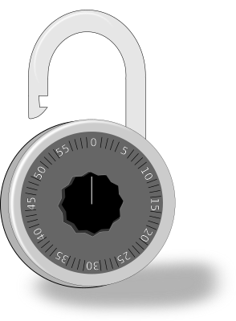

# Unlock the Combination Lock

## Description

Simulate a combination lock with a program that accepts one digit each time.

* The unlocking code is 1 3 1.
* Possible unlocking codes are the following:
    * 1 3 1
    * 8 1 7 1 3 1
    * 3 1 3 1
    * 1 1 3 1 (hint: this is what most people get wrong)

## Suggestions

I strongly suggest to try your own solution first. After that continue reading below.

This exercise is about parsing a stream of events.

1. Start in an initial state.
1. Receive an event.
1. Move to the next state depending on the event.
1. Repeating until done.

This is a State Machine. Try to solve the exercise by using a state machine.

# Lock with Lamp

After you have solved the above exercise try the following:

Assume that the lock has a lamp with different colors.

* When the lock is locked the color of the lamp is red.

* When the lock is unlocked the color of the lamp is green.

**Note**: The purpose of this exercise is to extend the transitions of your state machine in order to perform actions.
